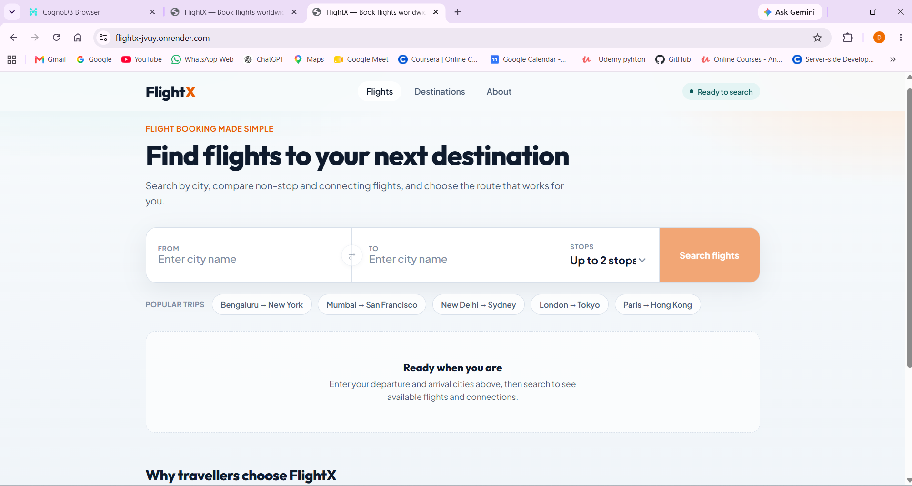
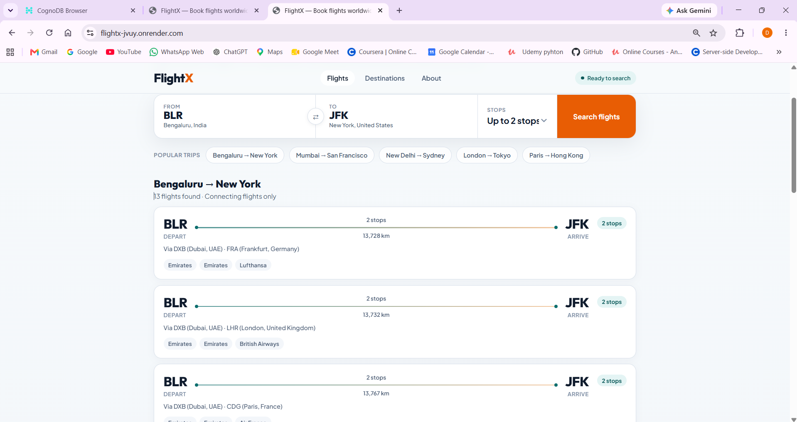
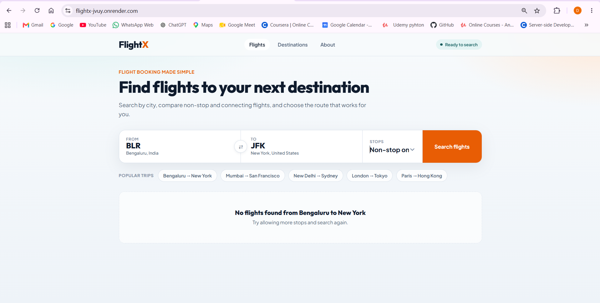

# FlightX — Flight Route Explorer

A graph-backed flight connection finder, built on **CognoDB** (openCypher over Bolt)

Type any two airports and FlightX finds every way to get between them — including
routes with no direct flight — by walking the airline network as a graph instead of
querying a flat schedule table.

## Why a graph database?

A route network *is* a graph before it's anything else: airports are nodes, flights
are directed edges. The questions worth asking about it are about paths, not rows:

- **"What connects A to B?"** has an unknown answer depth — it could be direct, or it
  could take three stops. A relational schema needs either a fixed number of self-joins
  (one per possible number of stops) or a recursive CTE that most engines optimize
  poorly. Cypher expresses it as a single bounded traversal: `-[:FLIES_TO*1..3]->`.
- **"If this airport closed, what breaks?"** means computing reachability twice —
  once on the full graph, once with a node removed — and diffing the two sets. This is
  naturally graph-shaped and awkward to express as SQL joins.
- **"Which airport is the critical bridge between two regions?"** is a centrality
  question: which node appears most often on the shortest path between two groups of
  endpoints. There's no relational equivalent that doesn't reinvent graph traversal
  inside application code.

All three queries are implemented and explained below.

## Data model

```
(:Country {name})
   ▲
   │ IN_COUNTRY
(:City {key, name})
   ▲
   │ LOCATED_IN
(:Airport {iata, name, lat, lon}) ─[:FLIES_TO {airlineIata, airlineName,
   │                                            alliance, distanceKm,
   │                                            equipment}]─▶ (:Airport)
   │
(:Airline {iata, name}) ─[:MEMBER_OF]─▶ (:Alliance {name})
```

**Modeling decision:** `alliance` and `distanceKm` are stored directly as properties on
the `FLIES_TO` relationship rather than requiring an extra hop through `Airline`. That
keeps alliance-filtered and distance-ranked multi-hop queries to a single traversal
instead of a join at every hop.

## The three key queries

Full copies live in `backend/cypher/`.

### 1. Multi-hop connection search (`cypher/01_multi_hop_connections.cypher`)
```cypher
MATCH path = (origin:Airport {iata: $from})-[legs:FLIES_TO*1..3]->(dest:Airport {iata: $to})
WHERE ($alliance IS NULL OR all(leg IN legs WHERE leg.alliance = $alliance))
WITH path, legs,
     reduce(km = 0, leg IN legs | km + leg.distanceKm) AS totalDistanceKm,
     [n IN nodes(path) | n.iata] AS stops
RETURN stops, size(legs) - 1 AS numStops, totalDistanceKm
ORDER BY totalDistanceKm ASC
LIMIT 15
```
Bounded variable-length traversal — the path depth is unknown ahead of time.

### 2. Disruption simulation (`cypher/02_disruption_simulation.cypher`)
Computes the set of reachable city pairs before and after excluding one airport from
every path, then diffs the two sets in application code to report what newly becomes
unreachable. Run twice per simulation — no relational equivalent without hand-rolling
a recursive reachability algorithm.

### 3. Bottleneck / chokepoint detection (`cypher/03_bottleneck_airports.cypher`)
For every pair of airports across two regions, finds the shortest path and tallies how
often each intermediate airport appears — a lightweight betweenness-centrality query.

## Running locally

### 1. CognoDB instance
1. Sign up at [console.cognodb.com/signup](https://console.cognodb.com/signup) (no
   card required).
2. Create a free `c0` instance, pick a region.
3. Copy the `bolt+s://...` URI and the generated password for the `cognodb` user —
   the password is shown once.

### 2. Backend
```bash
cd backend
npm install
cp .env.example .env   
npm run seed           
npm run dev             

### 3. Frontend
```bash
cd frontend
npm install
cp .env.example .env    
npm run dev              
```


## Screenshots


## Deploy on Render

This app needs **two Render services** (API + static frontend) plus your existing **CognoDB** instance.

### 1. Push to GitHub

Commit the repo (`.env` files stay local — they are in `.gitignore`).

### 2. Deploy the API (Web Service)

| Setting | Value |
|---|---|
| **Root Directory** | `backend` |
| **Build Command** | `npm install` |
| **Start Command** | `npm start` |
| **Health Check Path** | `/api/health` |

**Environment variables** (Render dashboard → Environment):

| Key | Value |
|---|---|
| `COGNODB_URI` | Your `bolt+s://...` URI |
| `COGNODB_USER` | `cognodb` |
| `COGNODB_PASSWORD` | Your CognoDB password |
| `CORS_ORIGIN` | Frontend URL (set after step 3), e.g. `https://flightx-web.onrender.com` |

Render sets `PORT` automatically — no need to add it.

### 3. Seed the database (once)

In the Render **backend service → Shell**:

```bash
npm run seed
```

### 4. Deploy the frontend (Static Site)

| Setting | Value |
|---|---|
| **Root Directory** | `frontend` |
| **Build Command** | `npm install && npm run build` |
| **Publish Directory** | `dist` |

**Environment variable** (must be set **before** build):

| Key | Value |
|---|---|
| `VITE_API_URL` | Your API URL, e.g. `https://flightx-api.onrender.com` |

**Rewrite rule** (Static Site → Redirects/Rewrites):

```
/*  /index.html  200
```

Or use the included `render.yaml` blueprint, which sets this automatically.

### 5. Link the two services

1. Copy the **frontend URL** → set `CORS_ORIGIN` on the API service → redeploy API.
2. Copy the **API URL** → set `VITE_API_URL` on the frontend → redeploy frontend.

### Optional: one-click deploy

Connect the repo via **New → Blueprint** and use the root `render.yaml`.

### Notes

- **Free tier:** the API sleeps after inactivity; the first request may take ~30s to wake up.
- **Vite env vars** are embedded at build time — changing `VITE_API_URL` requires a frontend redeploy.
- **CognoDB** must stay reachable from Render (cloud instances usually work with `bolt+s://`).

## Screenshots
  
  
  
  
